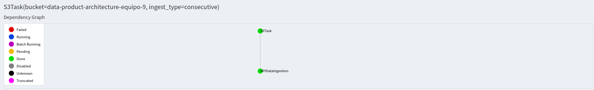

# Project: Food Inspections
DPA-ITAM, 2021.

### Team Members:

| CU     | Name               | GitHub user  |
| ------ | ------------------ | ------------ |
| 173013 | José Roberto Pérez | Roberto919   |
| 118626 | Mariana Lugo       | codeMariana  |
| 197727 | Santiago Battezzati| santibatte
| 197614 | Carlos Geovany Pérez| carlosgeovany|

## Introduction

The objective of the project is to develop a data product architecture. The dataset that will be used in the project contains information from inspections of restaurants and other food establishments in Chicago from January 1, 2010 to the present. 

#### Basic Project Structure

The Exploratory Data Analysis (EDA) can be found in `notebooks/EDA.ipynb`. The EDA was constructed with the data downloaded as of January 15th, 2021. It contains 17 columns and 215,067 observations.

#### Setup and Dependencies

This project requires:

1. [Python 3.7.4](https://www.python.org/downloads/release/python-374/) or later, with packages as specified in `requirements.txt`. If you have pip installed, packages can be installed by running `pip install -r requirements.txt`.

2. [Luigi](https://luigi.readthedocs.io/en/stable/): The project is orchestrated by Luigi. Luigi defines specific tasks to run a DAG process. A Task is an operation to be performed on an item of interest.  To declare a task in Luigi we need to have  script with 4 requires methods: `run()`, `input()`, `output()` and `requires()`.

    The `PYTHONPATH` should also include the root directory of this repository. This allows loading from Python modules referenced relative to the project root.

#### ETL 

* First, add the `credentials.yaml` file to `conf/local`. This file contains the credentials (`aws_access_key_id` and `aws_secret_access_key`) and token needed.
* Second, have an active s3 bucket with the name `data-product-architecture-equipo-9`.
* Third,`src/utils/general.py` you will find the functions to connect with s3 of AWS through the given credentials and API token needed for downloading the Chicago Food Inspections data.
* Next, in `src/pipeline/ingesta_almacenamiento.py` you will find the functions that call the API of the Chicago Food Inspections:
    1. The `get_client` function connects to the Chicago Food Inspections API through the given token.
    2. The `ingesta_inicial` function returns a list of the information given by the API, once the client and observations' limit are established.
    3. The `get_s3_resource` function gives a s3 resource to interact with AWS s3 based on `.yaml` file in order to save the data in the bucket.
    4. The `ingesta_consecutiva` function allows to set the desired date of the new data, according to it, the client and the observations' limit.
    5. The `guardar_ingesta` function downloads the data and stores it temporarily in local machine prior to the upload to s3. When it is a consecutive ingestion (not the initial), it finds the most recent date in the consecutive existing pickles. Then, it builds a query to download the data of interest. Last, it uploads the data to s3. 

#### Pipeline
Set the root directory of this repository in the terminal. Run the following command line to set the repository's PYTHONPATH: `export PYTHONPATH=$PWD`.

The pipeline process is organized into the following tasks:

***Task 1.***  `APIDataIngestion`: data extraction from Chicago Food Inspections API with the module `extract.py` . 

* For historic ingestion run `luigi --module src.pipeline.luigi.extract APIDataIngestion --ingest-type initial --local-scheduler`.

* For consecutive ingestion run `luigi --module src.pipeline.luigi.extract APIDataIngestion --ingest-type consecutive --local-scheduler`.

***Task 2.*** `S3Task`: storage of data in AWS S3 bucket with the module `save_s3.py`

* For `S3Task` run `luigi --module src.pipeline.luigi.save_s3 S3Task --ingest-type initial --bucket data-product-architecture-equipo-9 --root-path ingestion --year 2021 --month 03 --local-scheduler`

## Analytical Question:

¿Will the facility pass the inspection?

## The Dataset: 

The information is derived from inspections of restaurants and other food establishments in Chicago from January 1, 2010 to the present. Inspections are performed by staff from the Chicago Department of Public Health’s Food Protection Program. Inspections are done using a standardized procedure. The results of the inspection are inputted into a database, then reviewed and approved by a State of Illinois Licensed Environmental Health Practitioner (LEHP). A subset of data elements are extracted from this database and downloaded into this data portal. 

The dataset contains 17 columns:

• **Inspection ID**: unique identifier.

• **DBA**: ‘Doing business as.’ This is legal name of the establishment.

• **AKA**: ‘Also known as.’ This is the name the public would know the establishment as. 

• **License number**: This is a unique number assigned to the establishment for the purposes of licensing by the Department of Business Affairs and Consumer Protection. 

• **Type of facility**: Each establishment is described by one of the following: bakery, banquet hall, candy store, caterer, coffee shop, day care center (for ages less than 2), day care center (for ages 2 – 6), day care center (combo, for ages less than 2 and 2 – 6 combined), gas station, Golden Diner, grocery store, hospital, long term care center(nursing home), liquor store, mobile food dispenser, restaurant, paleteria, school, shelter, tavern, social club, wholesaler, or Wrigley Field Rooftop. 

• **Risk category of facility**: Each establishment is categorized as to its risk of adversely affecting the public’s health, with 1 being the highest and 3 the lowest. The frequency of inspection is tied to this risk, with risk 1 establishments inspected most frequently and risk 3 least frequently.   

• **Street address**, **city**, **state** and **zip code** of facility: This is the complete address where the facility is located.  

• **Inspection date**: This is the date the inspection occurred. A particular establishment is likely to have multiple inspections which are denoted by different inspection dates. 

• **Inspection type**: An inspection can be one of the following types: canvass, the most common type of inspection performed at a frequency relative to the risk of the establishment; consultation, when the inspection is done at the request of the owner prior to the opening of the establishment; complaint, when  the inspection is done in response to a complaint against the establishment; license, when the inspection is done as a requirement for the establishment to receive its license to operate; suspect food poisoning, when the inspection is done in response to one or more persons claiming to have gotten ill as a result of eating at the establishment (a specific type of complaint-
based inspection); task-force inspection, when an inspection of a bar or tavern is done. Re-inspections can occur for most types of these inspections and are indicated as such. 

• **Results**: An inspection can pass, pass with conditions or fail. Establishments receiving a ‘pass’ were found to have no critical or serious violations (violation number 1-14 and 15-29, respectively). Establishments receiving a ‘pass with conditions’ were found to have critical or serious violations, but these were corrected during the inspection. Establishments receiving a ‘fail’ were found to have critical or serious violations that were not correctable during the inspection. An establishment receiving a ‘fail’ does not necessarily mean the establishment’s licensed is suspended. Establishments found to be out of business or not located are indicated as such.  

• **Violations**: An establishment can receive one or more of 45 distinct violations (violation numbers 1-44 and 70). For each violation number listed for a given establishment, the requirement the establishment must meet in order for it to NOT receive a violation is noted, followed by a specific description of the findings that caused the violation to be issued.    

• **Latitude**: (Georeference) Latitude of the facility.

• **Longitude**: (Georeference) Longitude of the facility.

• **Location**: Longitude and Latitude.

**Data Owner**: Chicago Department of Public Health 

**Time Period**: 2010 - Present 

**Frequency**: This database is updated with information from new inspections daily. The data product arquitecture project will be updated weekly.

Disclaimer: Attempts have been made to minimize any and all duplicate inspection reports. However, the dataset may still contain such duplicates and the appropriate precautions should be exercised when viewing or analyzing these data. The result of the inspections (pass, pass with conditions or fail) as well as the violations noted are based on the findings identified and reported by the inspector at the time of the inspection, and may not reflect the findings noted at other times. 

Source: https://data.cityofchicago.org/Health-Human-Services/Food-Inspections/4ijn-s7e5 
