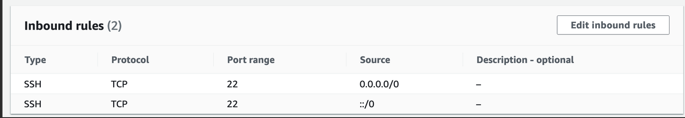
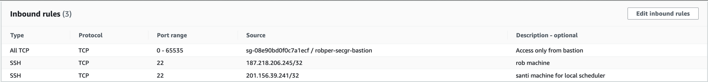
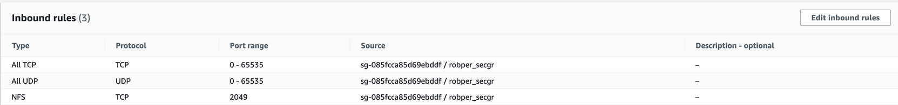
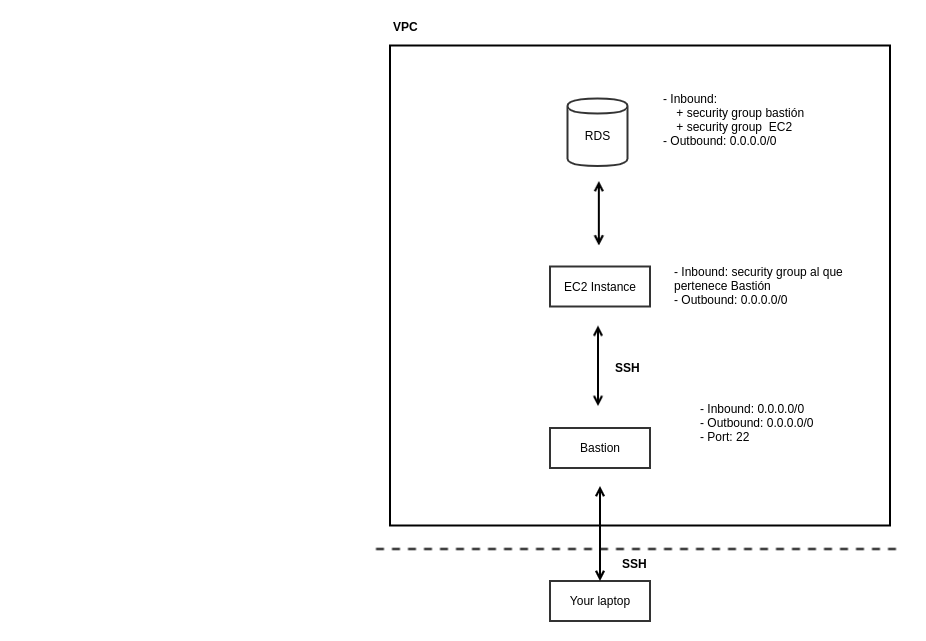
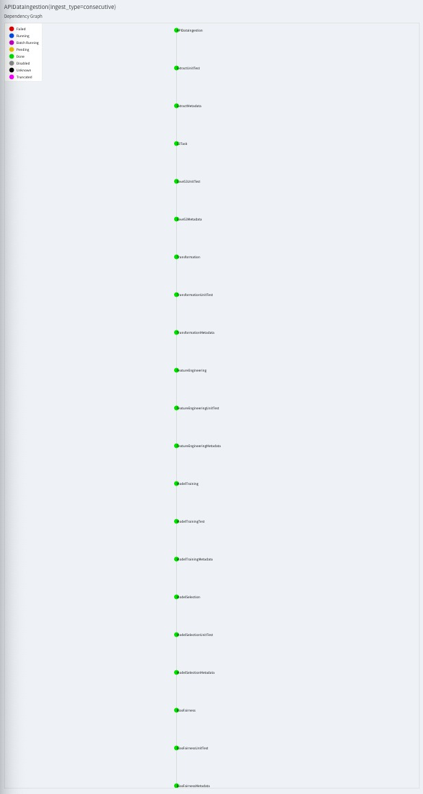

# Project: Food Inspections
DPA-ITAM, 2021.


# Team Members:

| CU     | Name               | GitHub user  |
| ------ | ------------------ | ------------ |
| 173013 | José Roberto Pérez | Roberto919   |
| 118626 | Mariana Lugo       | codeMariana  |
| 197727 | Santiago Battezzati| santibatte
| 197614 | Carlos Geovany Pérez| carlosgeovany|

## Table of contents

1. [Introduction](https://github.com/santibatte/dpa_2021.git#introduction)
2. [Overview](https://github.com/santibatte/dpa_2021.git#overview)
3. [Infrastructure requirements](https://github.com/santibatte/dpa_2021.git#infrastructure-requirements)
4. [Installation and setup](https://github.com/santibatte/dpa_2021.git#installation-and-setup)
5. [The Pipeline](https://github.com/santibatte/dpa_2021.git#the-pipeline)
6. [Aequitas](https://github.com/santibatte/dpa_2021.git#Aequitas)


## Introduction

The objective of the project is to develop a data product architecture. This project develops the analysis of food inspection in the City of Chicago. The dataset that will be used in the project contains information from inspections of restaurants and other food establishments in Chicago from January 1, 2010 to the present. 

The analytical question is : **¿Will the facility pass the inspection?**

### The Dataset

The information is derived from inspections of restaurants and other food establishments in Chicago from January 1, 2010 to the present. Inspections are performed by staff from the Chicago Department of Public Health’s Food Protection Program. Inspections are done using a standardized procedure. The results of the inspection are inputted into a database, then reviewed and approved by a State of Illinois Licensed Environmental Health Practitioner (LEHP).  

**Data Owner**: Chicago Department of Public Health 

**Time Period**: 2010 - Present 

**Frequency**: This database is updated with information from new inspections daily. The data product arquitecture project will be updated weekly.

The dataset contains 17 columns:

• **Inspection ID**: unique identifier.

• **DBA**: ‘Doing business as.’ This is legal name of the establishment.

• **AKA**: ‘Also known as.’ This is the name the public would know the establishment as. 

• **License number**: This is a unique number assigned to the establishment for the purposes of licensing by the Department of Business Affairs and Consumer Protection. 

• **Type of facility**: Each establishment is described by one of the following: bakery, banquet hall, candy store, caterer, coffee shop, day care center (for ages less than 2), day care center (for ages 2 – 6), day care center (combo, for ages less than 2 and 2 – 6 combined), gas station, Golden Diner, grocery store, hospital, long term care center(nursing home), liquor store, mobile food dispenser, restaurant, paleteria, school, shelter, tavern, social club, wholesaler, or Wrigley Field Rooftop. 

• **Risk category of facility**: Each establishment is categorized as to its risk of adversely affecting the public’s health, with 1 being the highest and 3 the lowest. The frequency of inspection is tied to this risk, with risk 1 establishments inspected most frequently and risk 3 least frequently.   

• **Street address**, **city**, **state** and **zip code** of facility: This is the complete address where the facility is located.  

• **Inspection date**: This is the date the inspection occurred. A particular establishment is likely to have multiple inspections which are denoted by different inspection dates. 

• **Inspection type**: An inspection can be one of the following types: canvass, the most common type of inspection performed at a frequency relative to the risk of the establishment; consultation, when the inspection is done at the request of the owner prior to the opening of the establishment; complaint, when  the inspection is done in response to a complaint against the establishment; license, when the inspection is done as a requirement for the establishment to receive its license to operate; suspect food poisoning, when the inspection is done in response to one or more persons claiming to have gotten ill as a result of eating at the establishment (a specific type of complaint-
based inspection); task-force inspection, when an inspection of a bar or tavern is done. Re-inspections can occur for most types of these inspections and are indicated as such. 

• **Results** (target variable): An inspection can pass, pass with conditions or fail. Establishments receiving a ‘pass’ were found to have no critical or serious violations (violation number 1-14 and 15-29, respectively). Establishments receiving a ‘pass with conditions’ were found to have critical or serious violations, but these were corrected during the inspection. Establishments receiving a ‘fail’ were found to have critical or serious violations that were not correctable during the inspection. An establishment receiving a ‘fail’ does not necessarily mean the establishment’s licensed is suspended. Establishments found to be out of business or not located are indicated as such.  

• **Violations**: An establishment can receive one or more of 45 distinct violations (violation numbers 1-44 and 70). For each violation number listed for a given establishment, the requirement the establishment must meet in order for it to NOT receive a violation is noted, followed by a specific description of the findings that caused the violation to be issued.    

• **Latitude**: (Georeference) Latitude of the facility.

• **Longitude**: (Georeference) Longitude of the facility.

• **Location**: Longitude and Latitude.


Disclaimer: Attempts have been made to minimize any and all duplicate inspection reports. However, the dataset may still contain such duplicates and the appropriate precautions should be exercised when viewing or analyzing these data. The result of the inspections (pass, pass with conditions or fail) as well as the violations noted are based on the findings identified and reported by the inspector at the time of the inspection, and may not reflect the findings noted at other times. 


## Overview

- The Exploratory Data Analysis (EDA) can be found in `notebooks/EDA.ipynb`. The EDA was constructed with the data downloaded as of January 15th, 2021. It contains 17 columns and 215,067 observations.


## Infraestructure requirements

We use the following Amazon Web Services(AWS) to run the all code:

- **S3 bucket** 
- **VPC**
- **EC2 instance:**
  * Bastión: You can access only if your keys are copied in the instance.
    
  * Processing: You can access this instance only through *Bastión*. Other IPs were added to do the portforwarding to see the Luigi's DAG.
    


- **RDS:** PostgresSQL
  
    RDS can only be accessed from the processing instance.

 

The general architecture copied from dpa course notes is:



## Installation and Setup 

1. Create a virtual environment with [Python 3.7.4](https://www.python.org/downloads/release/python-374/) or later. 
2. The project will run with the installed and updated packages as specified in `requirements.txt`. Packages can be installed by running `pip install -r requirements.txt`.
3. The project is orchestrated by [Luigi](https://luigi.readthedocs.io/en/stable/). Luigi defines specific tasks to run a DAG process. A Task is an operation to be performed on an item of interest.  To declare a task in Luigi we need to have  script with 4 requires methods: `run()`, `input()`, `output()` and `requires()`. 
4. The `PYTHONPATH` should also include the root directory of this repository. This allows loading from Python modules referenced relative to the project root. Set the root directory of this repository in the terminal. Run the following command line to set the repository's PYTHONPATH: `export PYTHONPATH=$PWD`.
5. To access de the S3 bucket and PostgresSQL RDS you will need the route where the credentials are located `../conf/local/credentials.yaml`. The credentials.yaml file should have te following: 

```
s3:
aws_access_key_id=your_key_id
aws_secret_access_key=your_secret_key

food_inspections:
  api_token: "your_api_token"
  
db:
    user='your_user'
    pass = 'your_password'
    db = 'name_of_your_database'
    host = 'your_host'
    port = '5432'
```
6. Add the `credentials.yaml` file to `conf/local`. This file contains the credentials (`aws_access_key_id` and `aws_secret_access_key`) and the API token.
7. Have an active s3 bucket with the name `data-product-architecture-equipo-9`.
8. In `src/utils/general.py` you will find the functions to connect with s3 of AWS through the given credentials and API token needed for downloading the Chicago Food Inspections data.
9. In `src/etl/ingesta_almacenamiento.py` you will find the functions that call the API of the Chicago Food Inspections:
    1. The `get_client` function connects to the Chicago Food Inspections API through the given token.
    2. The `get_s3_resource` function gives a s3 resource to interact with AWS s3 based on `.yaml` file in order to save the data in the bucket.
    3. The `ingesta_inicial` function returns a list of the information given by the API, once the client and observations' limit are established.
    4. The `ingesta_consecutiva` function allows to set the desired date of the new data, according to it, the client and the observations' limit.
    5. The `guardar_ingesta` function downloads the data and stores it temporarily in local machine prior to the upload to s3. When it is a consecutive ingestion (not the initial), it finds the most recent date in the consecutive existing pickles. Then, it builds a query to download the data of interest. Last, it uploads the data to s3. 
  
## The Pipeline
To connect you have to use your active EC2 address (ec2_address). As an example, we will use **ec2_address=ec2-34-222-150-101.us-west-2.compute.amazonaws.com**
1. Connect to EC2 Bastion Instance :
```
ssh -i 'your_pub_key' your_user@ec2_address= ec2-34-222-150-101.us-west-2.compute.amazonaws.com
```

2. Connect to EC2 Processing Instance: 
```
ssh -i 'your_pub_key' ubuntu@ec2-34-222-143-84.us-west-2.compute.amazonaws.com
```
3. After connecting to the Processing Instance:
   * Change to root user: `sudo su`
   * Change to repo directory: `cd dpa_2021`
   * Activate your pyenv with [Python 3.7.4](https://www.python.org/downloads/release/python-374/): `pyenv activate dpa_2021`
   * Packages can be installed by running `pip install -r requirements.txt`.

The pipeline process is organized into the following [Luigi](https://luigi.readthedocs.io/en/stable/) tasks ran in the Processing Instance:

***Task 1.***  `APIDataIngestion`: data extraction from Chicago food inspections API with the module `a_extract.py` . 

* For historic ingestion run `luigi --module src.pipeline.luigi.a_extract APIDataIngestion --ingest-type initial --local-scheduler`.

* For consecutive ingestion run `luigi --module src.pipeline.luigi.a_extract APIDataIngestion --ingest-type consecutive --local-scheduler`.

***Task 2.***  `ExtractUnitTest`: runs the unit test associated to the ingestion. The test checks that the ingestion's dataframe is not empty. 
* Example: `luigi --module src.pipeline.luigi.b_extract_test ExtractUnitTest --ingest-type consecutive --bucket data-product-architecture-equipo-9 --local-scheduler`


***Task 3.*** `ExtractMetadata`: generates the ingestion metadata with module `c_extract_metadata.py`.
* Example: `luigi --module src.pipeline.luigi.c_extract_metadata ExtractMetadata --ingest-type consecutive --bucket data-product-architecture-equipo-9 --local-scheduler`

***Task 4.*** `S3Task`: storage of data in AWS S3 bucket with the module `d_save_s3.py`.

* For historic ingestion run `luigi --module src.pipeline.luigi.save_s3 S3Task --bucket data-product-architecture-equipo-9 --ingest-type initial --local-scheduler`
* For consecutive ingestion run `luigi --module src.pipeline.luigi.d_save_s3 S3Task --bucket data-product-architecture-equipo-9 --ingest-type consecutive --local-scheduler`

***Task 5.*** `SaveS3UnitTest`: runs the unit test associated to the storage. The test checks that the size of the storaged pickle is not 0 KB. 
* Example: `luigi --module src.pipeline.luigi.e_saves3_test SaveS3UnitTest --ingest-type consecutive --bucket data-product-architecture-equipo-9 --local-scheduler`


***Task 6.*** `SaveS3Metadata`: generates the storage metadata with module `f_saves3_metadata.py`.
* Example: `luigi --module src.pipeline.luigi.f_saves3_metadat SaveS3Metadata --ingest-type consecutive --bucket data-product-architecture-equipo-9 --local-scheduler`

***Task 7.*** `Transformation`: preprocessing and transformation of data with module `g_transform.py`.

* Example: `luigi --module src.pipeline.luigi.g_transform Transformation --ingest-type consecutive --bucket data-product-architecture-equipo-9 --local-scheduler`

***Task 8.***  `TransformationUnitTest`: runs the unit test associated to the transformation process. The test checks that we have the new number of columns derived from transformation process.
* Example: `luigi --module src.pipeline.luigi.h_transform_test TransformationUnitTest --ingest-type consecutive --bucket data-product-architecture-equipo-9 --local-scheduler`

***Task 9.*** `TransformationMetadata`: generates the transformation metadata with module `i_transform_metadata.py`.
* Example: `luigi --module src.pipeline.luigi.i_transform_metadata TransformationMetadata --ingest-type consecutive --bucket data-product-architecture-equipo-9 --local-scheduler`

***Task 10.*** `FeatureEngineering`: perform feature engineering on data with module `j_feature_engineering.py`

* Example:`luigi --module src.pipeline.luigi.j_feature_engineering FeatureEngineering --ingest-type consecutive --bucket data-product-architecture-equipo-9 --local-scheduler`

***Task 11.*** `FeatureEngineeringUnitTest`: runs the unit test associated to the featuring engineering. The test checks that the dictionary with the feature engineering results is not empty.
* Example:`luigi --module src.pipeline.luigi.k_feature_engineering_test FeatureEngineeringUnitTest --ingest-type consecutive --bucket data-product-architecture-equipo-9 --local-scheduler`

***Task 12.*** `FeatureEngineering Metadata`: generates the feature engineering metadata with module `l_feature_engineering_metadata.py`.
* Example: `luigi --module src.pipeline.luigi.l_feature_engineering_metadata FeatureEngineeringMetadata --ingest-type consecutive --bucket data-product-architecture-equipo-9 --local-scheduler`

***Task 13.*** `ModelTraining`: performs the model training with the `m_model_training.py` module.
* Example: `luigi --module src.pipeline.luigi.m_model_training ModelTraining --ingest-type consecutive --bucket data-product-architecture-equipo-9 --local-scheduler`

***Task 14.*** `ModelTrainingTest`: runs the unit test associated to the models training. The test checks that there is enough observations to train the model (more than 50 observations).
* Example: `luigi --module src.pipeline.luigi.n_model_training_test ModelTrainingTest --ingest-type consecutive --bucket data-product-architecture-equipo-9 --local-scheduler`

***Task 15.*** `ModelTrainingMetadata`: generates the models training metadata with module `o_model_training_metadata.py`.
* Example: `luigi --module src.pipeline.luigi.o_model_training_metadata ModelTrainingTest --ingest-type consecutive --bucket data-product-architecture-equipo-9 --local-scheduler`

***Task 16.*** `ModelSelection`: performs the model selection with the `p_model_training.py` module.
* Example: `luigi --module src.pipeline.luigi.p_model_selection ModelSelection --ingest-type consecutive --bucket data-product-architecture-equipo-9 --local-scheduler`

***Task 17.*** `ModelSelectionUnitTest`: runs the unit test associated to the selection modeling. The test checks that our selected model pass the score threshold of .5.
* Example: `luigi --module src.pipeline.luigi.q_model_selection_test ModelSelectionUnitTest --ingest-type consecutive --bucket data-product-architecture-equipo-9 --local-scheduler`

***Task 18.*** `ModelSelectionMetadata`: generates the model selection metadata with module `r_model_training_metadata.py`.
* Example: `luigi --module src.pipeline.luigi.r_model_selection_metadata ModelSelectionMetadata --ingest-type consecutive --bucket data-product-architecture-equipo-9 --local-scheduler`

***Task 19.*** `ModelSelectionMetadata`: generates the model selection metadata with module `r_model_training_metadata.py`.
* Example: `luigi --module src.pipeline.luigi.r_model_selection_metadata ModelSelectionMetadata --ingest-type consecutive --bucket data-product-architecture-equipo-9 --local-scheduler`

***Task 20.*** `ModelSelectionMetadata`: generates the model selection metadata with module `r_model_training_metadata.py`.
* Example: `luigi --module src.pipeline.luigi.r_model_selection_metadata ModelSelectionMetadata --ingest-type consecutive --bucket data-product-architecture-equipo-9 --local-scheduler`

***Task 21.*** `ModelSelectionMetadata`: generates the model selection metadata with module `r_model_training_metadata.py`.
* Example: `luigi --module src.pipeline.luigi.r_model_selection_metadata ModelSelectionMetadata --ingest-type consecutive --bucket data-product-architecture-equipo-9 --local-scheduler`

***Task 22.*** `BiasFairness`: generates Aequitas analysis with module `s_bias_fairness.py`.
* Example: `luigi --module src.pipeline.luigi.s_bias_fairness BiasFairness --ingest-type consecutive --bucket data-product-architecture-equipo-9 --local-scheduler`

***Task 23.*** `BiasFairnessUnitTest`: generates Aequitas unit test with module `t_bias_fairness_test.py`.
* Example: `luigi --module src.pipeline.luigi.t_bias_fairness_test BiasFairnessUnitTest --ingest-type consecutive --bucket data-product-architecture-equipo-9 --local-scheduler`

***Task 24.*** `BiasFairnessMetadata`: generates Aequitas metadata  with module `u_bias_fairness_metadata.py`.
* Example: `luigi --module src.pipeline.luigi.s_bias_fairness BiasFairnessMetadata --ingest-type consecutive --bucket data-product-architecture-equipo-9 --local-scheduler`


#### Luigi's DAG Visualization

To see the Luigi Task Visualizer and do the following: 

1. Create a tunnel to the Processing machine:
   * Enable an inbound rule with your IP in the Processing machine. As an example, we will use our active processing machine address **ec2-54-201-9-79.us-west-2.compute.amazonaws.com**.
   * Enable your the key you use to accesc *Bastión* EC2 among the authorized keys in the Processing machine.
   
We recommend to have several terminals open to do the portfowarding: 

**Terminal 1:** In your local machine run: 
`ssh -i 'id_rsa' -NL localhost:4444:10.0.0.56:8082 ubuntu@ec2-54-201-9-79.us-west-2.compute.amazonaws.com`
   * Replace the address after the @ is your active process machine.
   * Replace 10.0.0.56 with the IP address of the processing machine. You will find it at the prompt of the processing machine, but written with hyphens. You must write it with dots, as in the example.

**Terminal 2:** After running the instructions in **3.** of **The Pipeline** to connect to your processing machine run:

`luigid`

**Terminal 3:** After running the instructions in **3.** of **The Pipeline** to connect to your processing machine run the your wanted Task removing the `--local scheduler`.

Open your local browser in `localhost:4444`. 

Your DAG should look like this!



## Disclamer: Luigi's Idempotence

In order to run these tasks again, you need to delete what indicates to luigi not to run again.
To run the metadata tasks again, you must enter PostgresSQL and run the following command:

`DROP TABLE IF EXISTS public.table_updates;`

This command deletes the table in which luigi saves the information that he has already run the metadata tasks, or any task that involves a CopyToTable, which is to save things in PostgresSQL.

* To run again the SaveS3, Transformation, Feature Engineering tasks, you must enter to the AWS S3 and delete the pickle of the day of the date, which is saved within its respective folder (ingestion for SaveS3, Transformation and Feature Engineering for the others two).
* To run Extract task, you must delete the file that is saved in the processing machine, at the address: 
`src/pipeline/luigi/ingestion_tmp/consecutive/`
  
* **Note**: Never delete the consecutive folder, otherwise you will have an error.

Dataset Source: https://data.cityofchicago.org/Health-Human-Services/Food-Inspections/4ijn-s7e5 


## Aequitas

Bias and Fairness analysis.

It is an assistive model as we want to help restaurants to realize if they would pass an inspection. 

The reference group are the restaurants that are located in richer neighborhoods. We use the zip code of the restaurants to determine in which group they are. 
The protected Attribute are restaurants located in poorer neighborhoods.

The metrics we use are those related to an assistive model: 
- Recall Parity
- FN/GS Parity 
- FOR Parity 
- FNR Parity

We choose these metrics as we want to make sure our model is being particularly accurate with those groups that could be discriminated
Therefore, we need to quantify disparities among the groups. 


